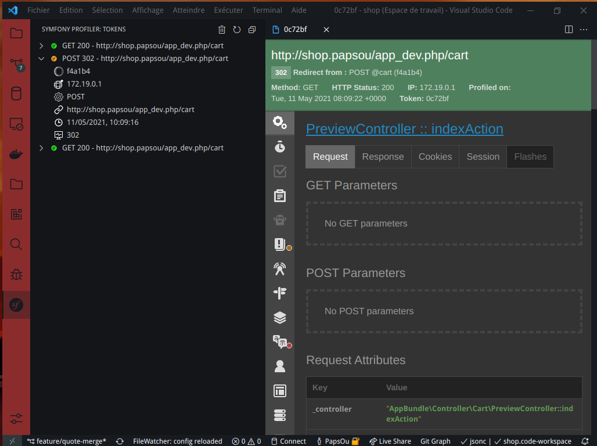

# Papsou Symfony Profiler

## Features

Display symfony profiler tokens directly into VSCode.

## Requirements

Having access to the Symfony's dev cache folder.

## Extension Settings

This extension have following settings (should be defined in workspace, not global):

* `papsou-symfony-profiler.symfonyCacheDir`: the project root relative cache directory path. e.g: `var/cache/dev`
* `papsou-symfony-profiler.ignoreUrlRegex`: an array of regexp used to ignore some request urls. e.g: ["style\\.css$", ".*\\.map$"]
* `papsou-symfony-profiler.profilerBaseUrl`: the base URL where you access your symfony profiler. e.g: `http://127.0.0.1/app_dev.php/_profiler/`

## Known Issues

No issues

## Release Notes

### 1.1.9

- Remove unused svg
- Remove alert message when no profiler is detected

### 1.1.8

- Fix icons (using native ones)
- Cleanup releases

### 1.1.7

- Ignore toggle link in profiler for webview navigation

### 1.1.6

- Dump panel css fix
- Add purge token command

### 1.1.5

- Fix http 500 icon

### 1.1.4

- Fix css theme for dump focus and search input
- Clean up releases

### 1.1.3

- Fix css theme for dump private / protected / public property names

### 1.1.2

- First release

### 1.1.1

- Clean up code
- Update README

### 1.1.0

- Add ignore patterns on profiled URLs

### 1.0.0

- First release
